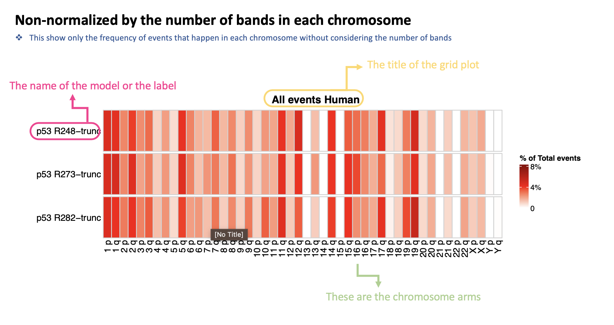
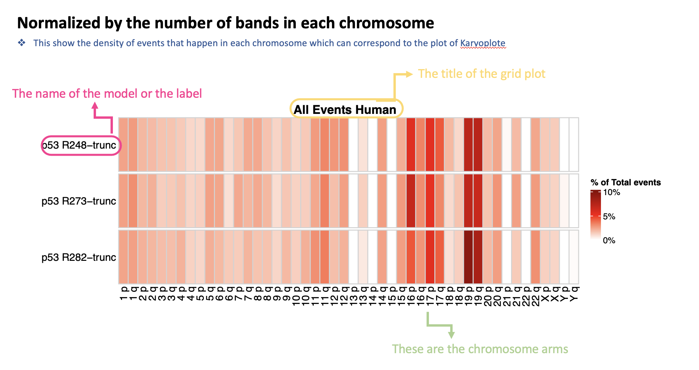

# Chromosome-Grid-Plot

The main purpose for creating chromosome grid plot is to undersatnding the most affected chromosome that has alternative splicing events happened.

Here, I create the R function for plotting the chromosome grid plot. There are grid plots for Human and Mouse in different functions. Moreover, there are also two ways to create the plot, one is just the frequency of the events, the other is the frequency that normalized by the number of bands in each chromosome, which can show the density and that is correspond to the existing R package [Karyoplote](https://github.com/bernatgel/karyoploteR)

The R function here will generates the list of of 2 elements: **1.Frequency dataframe** **2. chromosome grid plot**

To run the function, some R packages need to be install first: `ComplexHeatmap`, `dplyr`, `viridis`, `scales`





## Data Preparation

In order to plot the chromosome grid plot, we need data files that have chromosome and band annotation.

For example:
```markdown
A tibble: 2,432 × 5
   hgnc_symbol Event ID                                                                            AS type  chromosome_name  band  
   <chr>       <chr>                                                                               <chr>     <chr>           <chr> 
 1 ABCD4       ENSG00000119688.20;A5:chr14:74288259-74288660:74288259-74288716:-                   A5        14              q24.3 
 2 ABHD12      ENSG00000100997.18;AL:chr20:25294743:25295030-25302219:25300198:25300884-25302219:- AL        20              p11.21
 3 ABHD12B     ENSG00000131969.14;SE:chr14:50872278-50878745:50878847-50880452:+                   SE        14              q22.1 
 4 ABHD6       ENSG00000163686.14;SE:chr3:58237916-58249878:58249942-58256562:+                    SE        3               p14.3 
 5 ABI1        ENSG00000136754.16;SE:chr10:26751783-26759062:26759235-26765218:-                   SE        10              p12.1 
 6 ABI1        ENSG00000136754.16;SE:chr10:26751783-26759062:26759238-26765218:-                   SE        10              p12.1 
 7 ABI1        ENSG00000136754.16;A3:chr10:26759238-26765218:26759235-26765218:-                   A3        10              p12.1 
 8 ABR         ENSG00000159842.14;A5:chr17:1057102-1057844:1057102-1057970:-                       A5        17              p13.3 
```
The band annotation can be done by using `library(biomaRt)`

For example:
```markdown
library(biomaRt)
## Human
mart <- useMart(biomart = "ensembl", dataset = "hsapiens_gene_ensembl",host = "www.ensembl.org")
## Mouse
mart <- useMart(biomart = "ensembl", dataset = "mmusculus_gene_ensembl",host = "www.ensembl.org")
attributes <- getBM(attributes = c("ensembl_gene_id",'chromosome_name','band'),
                    filters = "ensembl_gene_id", values = unique(df$ENSG), 
                    mart = mart)
# df is the dataframe
```

## Plot the Chromosome Grid

There are three variables in each function. 

- **df_list**: the dataframe list, example :      
`df_list <- list(df1, df2)`

- **model_name**: the name(label) of your dataframe, this is the vector, example:         
`model_name <- c("p53 PDO shR-sh1","p53 PDO shR-sh2")`

- **title**: the final grid plot title, example:        
`title <- c ("Plots for All Events")`


First, download the **Grid Funcitons** folder, and then set the working directory to the path that you store the Grid Funcitons folder.

`setwd("/Users/the path/Grid Funcitons")`

Second, run the R function file you want by using source to specifiy the function you want.

`source("./R function files/[speices]_chrgrid.R")`

`source("./R function files/[speices]_Normalchrgrid.R")`

Thrid, input the varible in to the function and then get the output of Frequecy table and chromosome grid plot.

For example:

```markdown
## set working directory
setwd("/Users/Desktop/Grid Funcitons")

## get the function source
source("./R function files/Human_Normalchrgrid.R")

## create the variable
# model1, model2, model3 are dataframes

df_list <- list(model1, model2, model3)
model_name <- c("MUT-WT", "GOF-WT","GOF-EV",)
title <- c("All Events in Human")

## run the function
output <- Human_Normalchrgrid(df_list,model_name,title)

## get the frequecy table
Freq_table <- output[[1]]
# write into excel file
xlsx::write.xlsx(all,"Grid Frequency.xlsx", sheetName = "Human all events", append = TRUE)

## get the chromosome grid plot
grid_plot <- output[[2]]
# write into pdf
pdf("All_HumanGrid_events.pdf", height = 5, width = 10)
grid_plot
dev.off()

```
